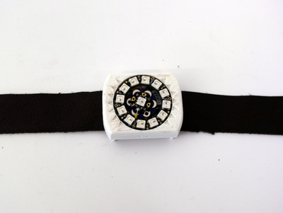
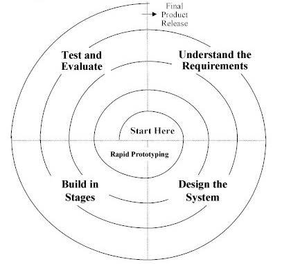
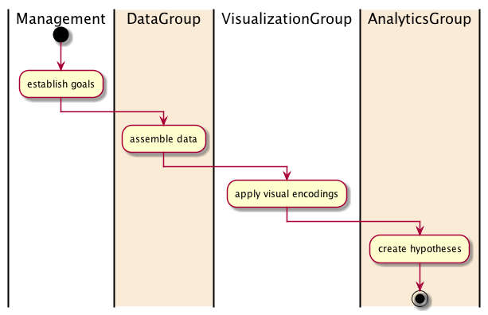
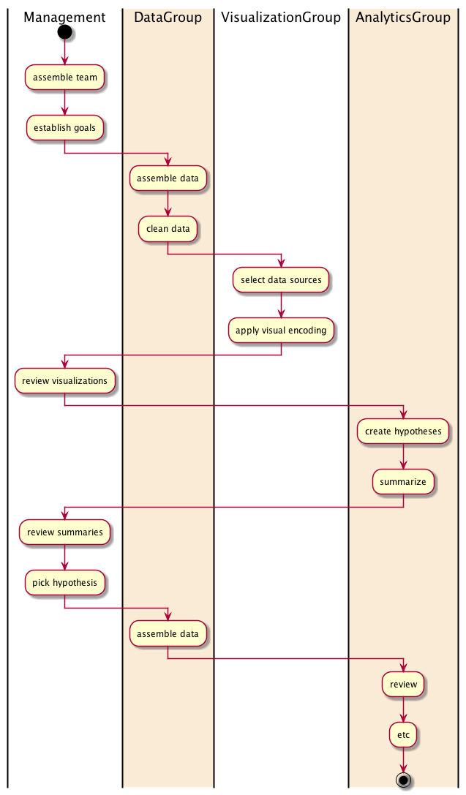

Visual Analytics and Interdisciplinary Teams
===========================================================================

.. class::
	heading2

Visual Analytics Lab | 2015-02-24

.. class:: whitebreak
	
	break

Michael Cumming, Ph.D.

Post-Doctoral Fellow, OCAD University

mcumming@ocadu.ca

.. class:: whitebreak
	
	break

.. image::
	images/OCAD_Logo.png
	:scale: 30%
	:align: left

.. footer::

	Visual_Analytics_Lab | 2015-02-24 . . . . . ###Page### / ###Total###

.. raw:: pdf

    PageBreak justFooter

Summary
--------------------------------------------------

- Interdisciplinary nature of Visual Analytics
- Interdisciplinary teams
- Collaborative design processes

Visual Analytics, definition
--------------------------------------------------

The science of analytical reasoning facilitated by interactive visual interfaces.

	`(Thomas & Cook, 2006)`_ 

.. class:: whitebreak
	
	break

.. class::
	heading2

	Is it:

- a design process (within organizations)?
- an analytical process?
- an artistic, or visualization, process?
- an organizational process designed to support decision-making?

VA is inherently interdisciplinary
--------------------------------------------------

- VA requires programmers, database experts, designers, analysts, artists, managers, etc.
- Typically, communities of practice to which VA team members belong may be quite different
- People need to learn to collaborate within organizations (with minimization of 'silos')

	`(Heer & Agrawala, 2008)`_

VA: similarities to collaborative design processes
-----------------------------------------------------

- Many sets of expertise required to solve complex problems
- Many possible solutions
- Action and reflection cycles
	
	`(Schön, 1983)`_

- Need to build 'common ground' to enable communication

	`(Clark, 1996)`_

- Use of 'boundary objects' between disciplines

	`(Bowker & Star, 2000)`_

Shared objects
--------------------------------------------------

.. class:: whitebreak
	
	break

.. image::
	images/P1140030-003.JPG
	:alt: infinity band 1
	:scale: 150%
	:align: center

Design iteration
--------------------------------------------------

- Most design problems are too difficult to solve, or make sense of, without iteration
- Problems to be solved may not be clear

	`(Schön, 1983)`_  `(Bucciarelli, 1994)`_

.. class:: whitebreak
	
	break

Waterfall model
--------------------------------------------------

- Waterfall models: only possible with simple, routine design problems

.. class:: whitebreak
	
	break

More realistic
--------------------------------------------------

Research questions
--------------------------------------------------

- How can VA teams be composed so they are sufficiently diverse?
- How can diverse teams learn to work well together?
- Where should VA teams fit into existing organizational structures?
- How can organizations facilitate communication between disciplines?

References
--------------------------------------------------

.. class::
	reference

	.. _(Bowker & Star, 2000):

	G. C. Bowker and S. L. Star. 
	"Sorting things out: Classification and its consequences". 
	MIT press,    2000. 

	.. _(Bucciarelli, 1994):
	   
	L. L. Bucciarelli. 
	"Designing engineers". 
	MIT press,    1994. 

	.. _(Clark, 1996):

	H. H. Clark. 
	"Using language". 
	Cambridge University Press,    1996. 

	.. _(Heer & Agrawala, 2008):

	J. Heer and M. Agrawala. 
	"Design considerations for collaborative visual analytics". 
	In *Information visualization*,    volume 7 (no. 1)    p49 -- 62. 
	SAGE Publications,    2008. 

	.. _(Schön, 1983):

	D. A. Schön. 
	"The reflective practitioner: How professionals think in action". 
	Basic books,    1983. 

	.. _(Thomas & Cook, 2006):

	J. J. Thomas and K. A. Cook. 
	"A visual analytics agenda". 
	In *Computer Graphics and Applications, IEEE*,    volume 26 (no. 1)    p10 -- 13. 
	IEEE,    2006. 

.. raw:: pdf

    PageBreak justFooter

Michael Cumming | mcumming@ocadu.ca

OCAD University, Toronto, Canada 

.. class:: whitebreak
	
	break

.. class:: whitebreak
	
	break

.. image::
	images/OCAD_Logo.png
	:scale: 30%
	:align: left

	   

