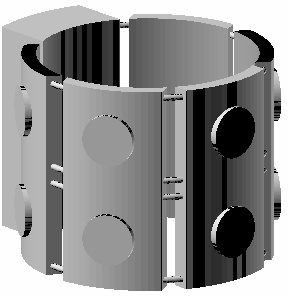
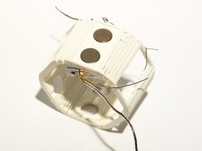
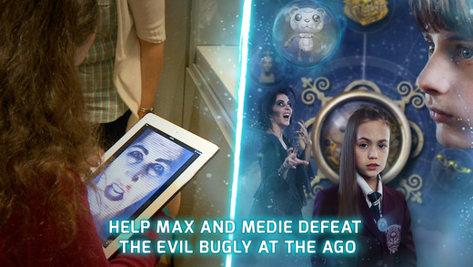
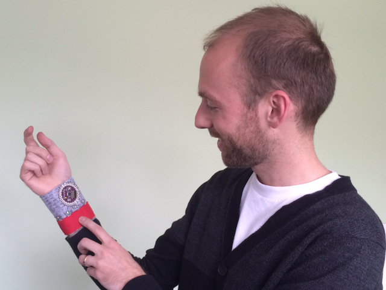
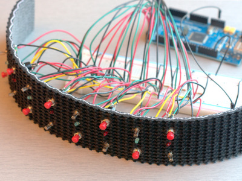
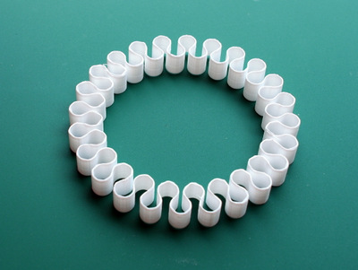
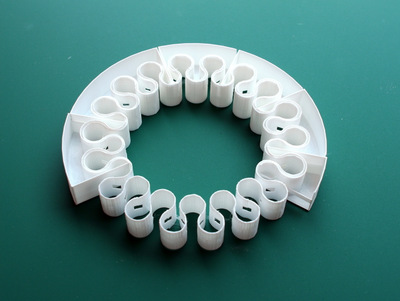
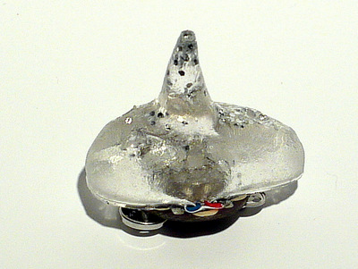
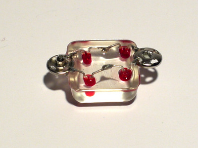

==================================================
Visual Analytics and Research
==================================================

.. class::
	heading2

What are good research questions in VA?

.. class::
	heading2
	
How do you build knowledge?

.. class:: whitebreak
	
break

Michael Cumming, Ph.D. | mcumming@ocadu.ca

Visual Analytics Lab | 2015-02-24

.. class:: whitebreak
	
break

.. image::
	images/OCAD_Logo.png
	:scale: 20%
	:align: left

.. footer::

	Visual_Analytics_Lab | Michael Cumming | 2015-02-24 . . . . . ###Page### / ###Total###

.. raw:: pdf

    PageBreak justFooter

Definition of domain 
--------------------------------------------------

Is Visual Analytics
..................................................
	
- a design process?
- an analytical process?
- an artistic, or visualization, process?

.. class:: whitebreak
	
	break

Obviously, all three
..................................................

- Visual Analytics is inherently interdisciplinary
- Therefore, you'll need designers, analysts, artists

Some Ideas
--------------------------------------------------

Research needs questions
...............................................................

- Research depends on interesting (and well-informed) questions
- A good question is a compact formulation of the current state of knowledge
- Good questions are surprisingly difficult

In design, information is necessary, but insufficient
......................................................

- Design is an information-rich field, yet more information does not necessarily mean better design

Good research questions?
--------------------------------------------------

What don't you know?
.........................................................

What are you trying to find out?
..................................................

Research Questions MGDS-PET Project, OCAD 2014-15
--------------------------------------------------

- What sorts of information can be transmitted using wearable devices?
- Is this information symbolic or it is kinesthetic?
- Can these devices do something, which is difficult to do with other means?

Research Questions: Musical notation for wearable devices
-----------------------------------------------------------

- What is the easiest way to author patterns for these devices?
- Is musical notation an efficient way of authoring patterns?
- Can types of vibro-compositions align with important points in transmedia narratives?

	- For example:
	- if arrays are 2D and circular, should music also be '2D'?

Research Questions: Ambitious City
--------------------------------------------------

- If you ask the right questions on urban design would this inspire more inventive urban design discourse?

Wrist-wearables for transmedia gaming
--------------------------------------------------

Vibrotactile arrays are a new type of component for wearables

- They can be placed on the wrist, or elsewhere on the body
- For non-disruptive notification and tactile entertainment

.. class:: whitebreak
	
	break

.. class:: whitebreak
	
	break

	3D printed band for an array of vibrating motors.

Use Cases for the Bracelet
--------------------------------------------------

- Interface with Time Tremor mobile app
- Interpret wrist gestures of child player
- Notify player when treasures are earned
- Offer a variety of vibrotactile clues related to game narrative

.. class:: whitebreak
	
	break
	

	Time Tremor app for the AGO, by Xenophile Media.

Music Notation
--------------------------------------------------

A highly evolved and standardized graphical language

- Time & duration represented horizontally
- Pitch normally represented vertically
- More than one part possible on one staff
- More staves can be added for additional parts

.. class:: whitebreak
	
	break

.. figure::
	images/arrowsMoving-00.pdf
	:scale: 100%
	:width: 85%
	:align: center

	Output from Lilypond software.

Material Explorations
--------------------------------------------------

	Early felt bracelet with buttons and vibe motors.

	Early rubber bracelet with vibe motors.

	Early 3D printed bracelet with vibe motors.

	3D printed meander band 1.

	3D printed meander band 2.

	Molded resin bead 1.

	Molded resin bead 2.

Notation Experiment 1
--------------------------------------------------

Single Vibe Motor

.. image::
	images/postertMusic1.pdf
	:width: 85%
	:align: center

- Time = horizontal axis
- Rhythmic information as per standard musical notation
- Vertical position does not vary
- Information is not very dense (single line score would suffice)

Thanks for your attention!
---------------------------

Michael Cumming | mcumming@ocadu.ca

OCAD University, Toronto, Canada

.. class:: whitebreak
	
	break

.. class:: whitebreak
	
	break

.. image::
	images/OCAD_Logo.png
	:scale: 20%
	:align: left

.. raw:: pdf

    PageBreak blackPage

