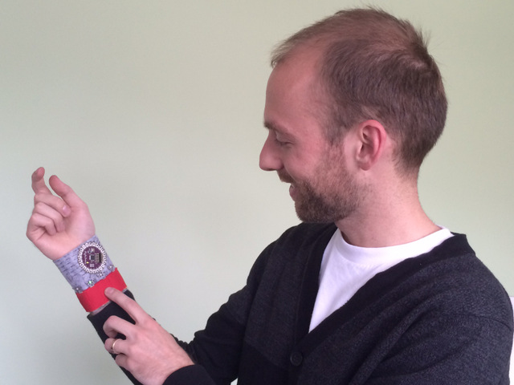
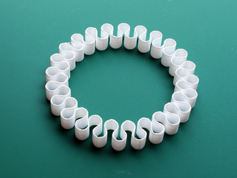

.. footer::

	Visual_Analytics_Lab | Michael Cumming | 2015-01-27 . . . ###Page### / ###Total###

==========================================================
Haptic Pattern Representation Using Music Technologies
==========================================================

Michael Cumming | mcumming@ocadu.ca

Co-authors: Adam Tindale | Sara Diamond

Visual Analytics Lab | 2015-01-27

CIM14: Conf. on Interdisciplinary Musicology Berlin | 2014-12-04

.. class:: whitebreak
	
	break

.. image::
	images/OCAD_Logo.png
	:scale: 20%
	:align: right

.. raw:: pdf

    PageBreak justFooter

Wrist-wearables for transmedia gaming
--------------------------------------------
Vibrotactile arrays are a new type of component for wearables

- They can be placed on the wrist, or elsewhere on the body
- For non-disruptive notification and tactile entertainment

.. class:: whitebreak
	
	break

.. class:: whitebreak
	
	break

	3D printed band for an array of vibrating motors.

Research Questions
--------------------
- What is the easiest way to author patterns for these devices?
- Is musical notation suitable?
- Does musical notation align with the types of 'compositions' required for these devices?

	- For example:
	- if arrays are 2D and circular, should music also be '2D'?

Use Cases for the Bracelet
------------------------------
- Interface with Time Tremor mobile app
- Interpret wrist gestures of child player
- Notify player when treasures are earned
- Offer a variety of vibrotactile clues related to game narrative

.. class:: whitebreak
	
	break
	

	Time Tremor app for the AGO, by Xenophile Media.

Music Notation
-------------------------
A highly evolved and standardized graphical language

- Time & duration represented horizontally
- Pitch normally represented vertically
- More than one part possible on one staff
- More staves can be added for additional parts

.. class:: whitebreak
	
	break

.. figure::
	images/arrowsMoving-00.pdf
	:scale: 100%
	:width: 85%
	:align: center

	Output from Lilypond software.

Lilypond Music Notation Software
-------------------------------------

.. figure::
	images/lilypondScreenshot.png
	:width: 85%
	:align: center

	Example of Lilypond musical markup.

Material Explorations
-----------------------------

	Early felt bracelet with buttons and vibe motors.

	Early rubber bracelet with vibe motors.

	Early 3D printed bracelet with vibe motors.

	3D printed meander band 1.

	3D printed meander band 2.

	Molded resin bead 1.

	Molded resin bead 2.

Notation Experiment 1
--------------------------------------
Single Vibe Motor

.. image::
	images/postertMusic1.pdf
	:width: 85%
	:align: center

- Time = horizontal axis
- Rhythmic information as per standard musical notation
- Vertical position does not vary
- Information is not very dense (single line score would suffice)

Notation Experiment 2
-----------------------------------------
Line of Vibe Motors

.. image::
	images/postertMusic2.pdf
	:width: 85%
	:align: center

- Specifies activations for five, independent vibe motors
- Vertical staff position specifies vibe motor to activate
- PROBLEM: Five unpitched parts on one staff are hard to read, especially if rhythms are complex
- NEXT STEP: Make notation less dense and more readable

Notation Experiment 2, 
-----------------------------------------------
Less density, more readability

.. image::
	images/postertMusic3.pdf
	:width: 60%
	:align: center

- Specifies activations for five, independent components
- Five part single-line staff, rhythmic notation 
- NEXT STEP: Make notation suitable for two dimensional arrays of vibe motors

Notation Step 3
------------------------------------------
2D Array of Vibe Motors

.. image::
	images/postertMusic4.pdf
	:width: 50%
	:align: center

- Ten components that need independent addressability 
- Either five staves (for columns) or two staves (for rows)

Results & Conclusion
------------------------------
- Standard music notation provides a nuanced, graphical representation for rhythmic events, which is hugely useful for our purposes.
- Music notation is typically two-dimensional: x-axis handles time; y-axis represents pitch and parts
- Physical adjacencies of musical instruments are usually not represented in their notation, therefore, authoring for 2D arrays is not straightforward. 
- Multiplication of parts and staves seems the simplest [naive] approach

Future Work
--------------------
- Future work depends on functional prototypes that require vibrating activation patterns
- Connecting mobile narratives to these devices and patterns seems particularly promising 
- Conceivably, several 'musical' genres could arise from such work

.. raw:: pdf

    PageBreak lastPage

.. header:: Haptic Pattern Representation Using Music Technologies

Thanks for your attention!
---------------------------

Michael Cumming | mcumming@ocadu.ca

OCAD University, Toronto, Canada

.. class:: whitebreak
	
	break

.. image::
	images/OCAD_Logo.png
	:scale: 15%
	:align: left

.. raw:: pdf

    PageBreak blackPage

